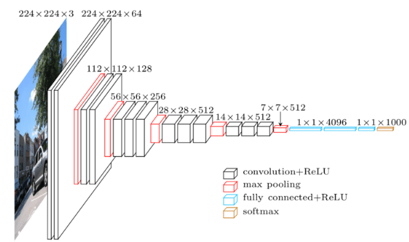
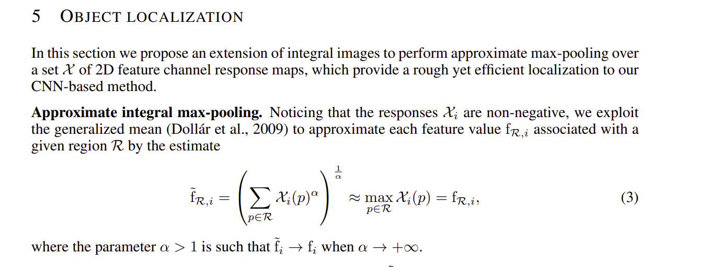
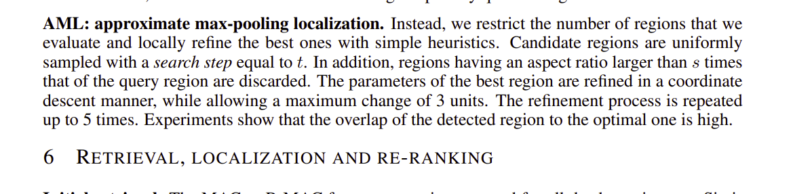
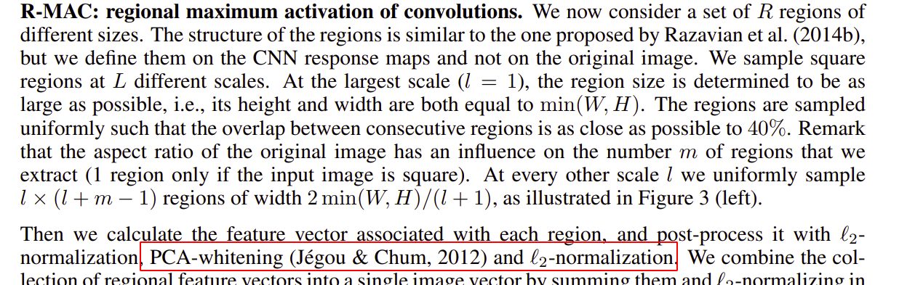
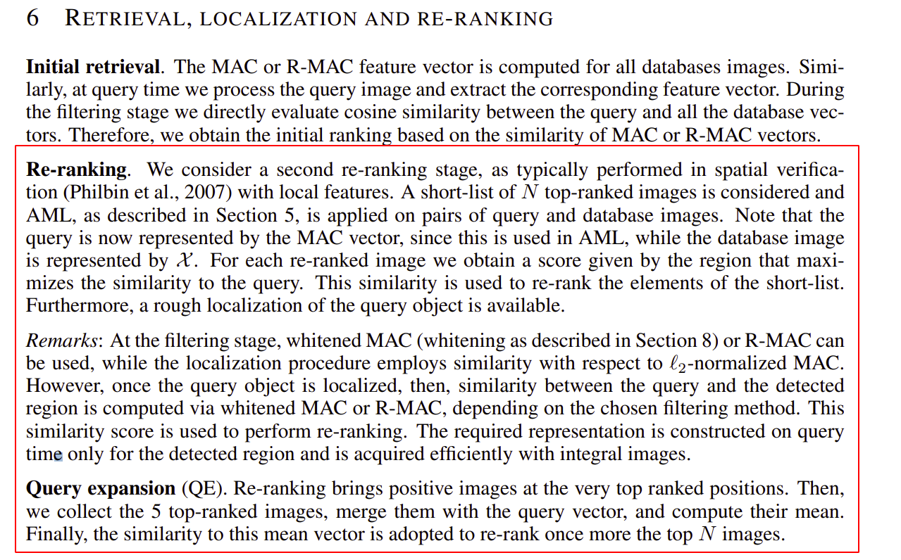

# Instance Search with CNN

In the instance search task, given a image with one or multiple object bounding box(es), you are required to retrive images containing similar objects and moreover, locate them. 

In this post, I introduce my CNN based methodlogy and implementation. You can access all code on github: 

Basically, I use [VGG16](https://arxiv.org/abs/1409.1556) + [RMAC (regional maximum activation of convolutions)](https://arxiv.org/abs/1511.05879) layer to get feature representation for retrieval and object localization.


## Prelimnaries

### VGG 16
Every deep learning guy knows VGGNet. Basically, it advocates small-size (3\*3) convolutional kernels and deeper architecture, e.g. using 2 3\*3 kernels to replace one 5\*5 kernel. Here are several useful materials for this topic:
* [VGGNet paper]()
* [Review: VGGNet — 1st Runner-Up (Image Classification), Winner (Localization) in ILSVRC 2014](https://medium.com/coinmonks/paper-review-of-vggnet-1st-runner-up-of-ilsvlc-2014-image-classification-d02355543a11)
* [一文读懂VGG网络-知乎](https://zhuanlan.zhihu.com/p/41423739)

| VGG16 architecture |
|-|
||

### RMAC layer

RMAC or Regional Maximum Activation of Convolutions, is published in [Particular object retrieval with integral max-pooling of CNN activations](https://arxiv.org/abs/1511.05879)

The mechanism of RMAC is somewhat simple and intuitive:

First, uniformly generate a set of multiscale sliding windows, each determines a region. Assume we have `$$R$$` regions.

Then for each region, apply max-pooling to get a 512-dimensional feature vector folllowed with L2 normalization to get  regional feature vectors  `$$\{ v_{i} \}_{i=1}^R$$`.

Finally, aggregate all regional feature vectors by summation `$$\sum\{ v_{i} \}_{i=1}^R$$`,  and again do L2 normalization to get `$$v_{ag}$$`.


## Instance Search Pipeline

```flow
st=>start: read  query image and corresponding bounding box(es)
pp=>operation: preprocessing: mask image with bounding box(es)
cnn=>operation:  feature extraction: VGG16 + RMAC
search=>operation:  retreival: get top k matches by cosine similarity 
cond=>condition: locate objects?
loc=>operation: object localization
ed=>end: return retrived information

st->pp->cnn->search->cond->ed

cond(yes)->loc->ed
cond(no)->ed
```

### preprocessing
We first mask image with provided bounding boxes. Specifcally, we replace pixels outside object bouding boxes with zeros. This is to make feature extraction focus on target query region.

### feature extraction
Then we feed masked image to tailored VGG16 feature extrator followed with RMAC layer.

For VGG 16,  the classifier part (fully connected layers) is removed thus not used. We start from extracting feature map in pool5 layer. Then we pass pool5 feature into RMAC layer to get image embedding.

### image retrieval
Compute cosine similarity between query feature with cached database feature matrix and return top matches. The cached feature matrix containg all feature vectors of database images extracted in the same way of query image. Top k similar images are returned.

### object localization (optional)
For all retrieved images, we localize query objects as follows:

First, we  feed each query object patch to vgg16 feature extractor followed with  **global max-pooling** to get object feature `$$v_{obj}$$`.
Then we compute cosine similarity between  `$$v_{obj}$$` cached reagional feature matrix  `$$\{ v_{i} \}_{i=1}^R$$` of target retrieved image and locate the most similar region `$$R_p = (i, j, h, w)$$` on vgg16 pool5 layer, and finally map regions back to image using linear transformation: `$$R_I = (s_h * i,  s_w*j,  s_h*h, s_w*w)$$`, where `$$s_h = H_I / H_{pool5}$$`, `$$s_w = W_I / W_{pool5}$$`.

In practice, each back projected region w.r.t regional feature vector is acturally precomputed and cached, instead being computed on-the-fly. Corresponding function is [here]()


## Differences from original RMAC

My implementation is somewhat different from the RMAC paper described. 


### I  do not use approximate integral max-pooling

The approximate integral max-pooling operation described in [paper](https://arxiv.org/pdf/1511.05879.pdf) can reduce time complexity for RMAC caculation from $O(W^2 \dot H^2)$ to $O(W \dot H)$, using the [integral image trick](https://en.wikipedia.org/wiki/Summed-area_table). This is of course quite a gain **for serialized scenario**. However, since computing integeral image is actually a dynamic prgramming strategy which involves with heavy data dependency, it's **Not friently to parallel computing**, thus useless even harmful if you use GPU for inference.

### I don't apply AML (approximate max-pooling localization) refinement

Of course I didn't implement **approximate** integral max-pooling, as depicted above. But I even DID NOT apply max-pooling localization refinement. The main reason is that, I don't think it's worthy for the cost it brings, and moreover, I'm lazy. 

### no extra PCA-whitening  and L2-normalization step to post-process regional features

I don't comprehend the motivation of these two steps. Then I just skip them to keep it simple :).


### no re-ranking and query expansion

Again, I just want to keep my system simple, so such extensions are not included. But maybe I will add it later.

Here is the table for these techincal details described in paper. Click image to zoom in.

| approximate integral max-pooling in section 5 of paper | AML refinement (section 5) | regional feature post-processing (section 4) | re-ranking and query expansion (section 6) |
|-|-|-|-|
||  |||


##  Analysis

### Why don't we remove FC layers in VGG16?
* if not, VGG16 can only receive size fixed (224 * 224) input, which means we must resize all images, this may be harmful since objects will be distorted.
* FC layers occupy most parameters of VGG, removing them makes the model light, more efficient.

### What's the strength of RMAC?
* Objects have have varied size in different images, RMAC feature takes into account the effect of scale, thus makes retrieval more precise.
* Another strength is that, rough object localization is redily applicable by searching the most similar region in retrieved image

### Why don't We use RPN or anchors for object localization?
RPN or anchors used in object detection methods are trained to localize limited class of objects. However, in image retrieval, possible objects emerging in query image can be anything, in another word, instance retrieval can be viewed as open-set object detection. RPN and anchor are not scalable to such cases.


## References
1. [VGGNet paper](https://arxiv.org/abs/1409.1556)
2. [RMAC paper](https://arxiv.org/abs/1511.05879)
3. [integral image / Summed-area table](https://en.wikipedia.org/wiki/Summed-area_table))

